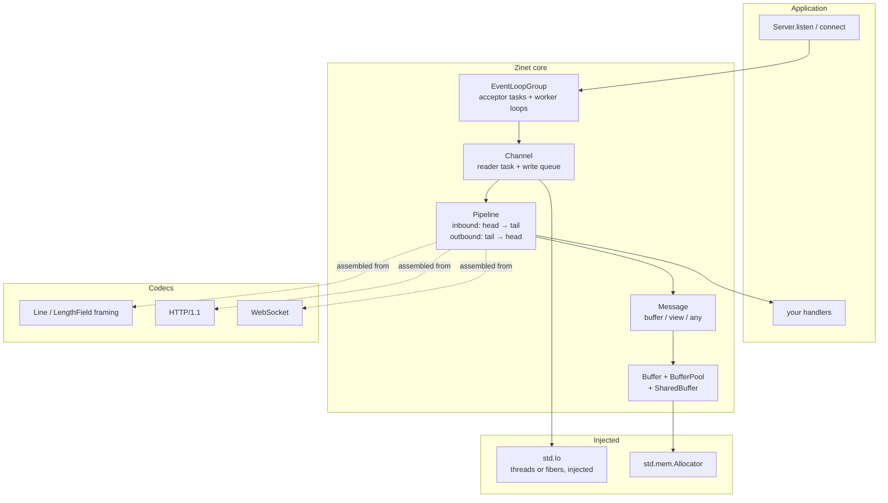

# Zinet

An event-driven network application framework for Zig, in the spirit of Java's
[Netty](https://github.com/netty/netty). Built on Zig 0.17's `std.Io`, with no
dependencies outside the standard library.

```zig
const zinet = @import("zinet");

const EchoHandler = struct {
    pub fn onRead(_: *EchoHandler, ctx: *zinet.HandlerContext, msg: zinet.Message) !void {
        return ctx.writeAndFlush(msg);
    }
};

fn buildPipeline(pipeline: *zinet.Pipeline) anyerror!void {
    const handler = try pipeline.gpa.create(EchoHandler);
    handler.* = .{};
    _ = try pipeline.addLast("echo", .initOwned(handler));
}

const server = try zinet.Server.listen(.{
    .gpa = gpa,
    .io = io,
    .address = .{ .ip4 = .unspecified(8007) },
    .child = .{ .initializer = .initFunction(buildPipeline) },
});
defer server.deinit();
try server.serve();
```

## Status

Working and tested: the core framework, framing codecs, HTTP/1.1 and WebSocket in
both directions with `permessage-deflate`, Redis RESP2/RESP3, datagram (UDP)
endpoints, and TLS 1.3 client connections. 272 tests pass on Linux and macOS in
Debug, ReleaseSafe and ReleaseFast, all under a leak-checking allocator, plus
eleven fuzz targets. The same suite also runs **on fibers** rather than threads —
see [Choosing an `Io`](#choosing-an-io). Every protocol is checked against
other people's code, not only its own counterpart: the HTTP server against
`curl`, the HTTP client against Python's `http.server`, the WebSocket client *and*
server against the third-party `websockets` library, the RESP server against
`redis-py`, the UDP endpoint against Python's `socket` and `nc -u`, and the TLS
client against OpenSSL's `s_server`.

Those cross-implementation checks run in CI, not only by hand, which is what
caught the last defect on the list: a closing handshake that was skipped about
one run in five. The review's findings and all eighteen defects it, the fuzzer and
cross-implementation testing turned up are written down in
[REVIEW.md](REVIEW.md).

Not done: HTTP/2, and TLS on the server side. Both are blocked upstream rather
than merely unwritten — the server needs a `std.crypto.tls.Server` that does not
exist, and HTTP/2 needs ALPN, which `std.crypto.tls.Client` never offers.
[HTTP2.md](HTTP2.md) works through what HTTP/2 would cost and what it would
break; the short version is that it would also force write water marks back into
a framework that argues against them.

### Blocked upstream

Four things are absent because the standard library does not yet provide what
they need. They are listed separately from the design choices below on purpose:
these would be built tomorrow if the pieces existed, and each is stated with the
specific thing that is missing so the claim can be checked rather than taken on
trust.

| Wanted | What is missing | Where that is visible |
|---|---|---|
| `remoteAddress()` on a stream | `getpeername` | `std.Io` 0.16 exposes no such operation. Datagrams have the address anyway, because `recvmsg` reports it per message. |
| TLS on the server side | `std.crypto.tls.Server` | `std/crypto/tls/` contains `Client.zig` and nothing else. Accepting a connection would mean hand-rolling certificate loading, `CertificateVerify` signing and session tickets. |
| HTTP/2 over TLS | ALPN in the TLS client | `tls.Client.Options` has no ALPN field, and the `ClientHello` is built from five extensions of which ALPN is not one. RFC 9113 §3.1 identifies `h2` by ALPN, so every conforming server answers HTTP/1.1. See [HTTP2.md](HTTP2.md). |
| An evented `Io` *in the standard library* | a backend that can listen, accept and connect | the table below. In 0.17-dev those three are stubs on every platform. A third-party one works today; see [Choosing an `Io`](#choosing-an-io) |

The evented case deserves its own detail, because Zinet takes its `Io` as a
parameter precisely so the application can choose the backend, and an evented one
is the interesting case: every task becomes a fiber rather than a thread. It is
worth being exact about what is missing, because "it does not compile" was true in
0.16 and is no longer the whole story:

| Backend | Selected on | State in 0.17-dev |
|---|---|---|
| `Io/Uring.zig` | Linux | Compiles. `netReceive`, `netBindIp`, `netShutdown` and `netClose` are implemented; `netListenIp`, `netAccept`, `netConnectIp`, `netSend`, `netWrite` are wired to `…Unavailable` stubs that return `error.NetworkDown` |
| `Io/Dispatch.zig` | macOS | Does not compile: `deinit` frees `main_loop_stack[0..len]`, a `*[len]u8`, and `Allocator.free` rejects it — even though `free`'s own precondition permits exactly that, because the next line hands it to `absorbSentinel`, which asserts a slice. With that one line fixed it compiles and runs, and then only `netClose` of the network operations is implemented |
| `Io/Kqueue.zig` | the BSDs | Does not compile: assigns `fileWriteStreaming` and `fileReadStreaming`, neither of which is a field of `Io.VTable` |

So the blocker moved rather than lifted. A framework whose whole job is sockets
cannot use a backend that cannot listen, accept or connect, and on both platforms
those are stubs. Nothing stops a *different* implementation of the same interface,
which is the point of taking `Io` as a parameter. See below.

### Choosing an `Io`

Zinet names no I/O implementation; it takes one. `-Dio=` selects which one the
tests, examples and benchmarks run on:

```
zig build test              # std.Io.Threaded: every task is an OS thread
zig build test -Dio=zio     # fibers, via github.com/lalinsky/zio (its zig-0.17 branch)
```

The library keeps depending on nothing outside the standard library. The zio
dependency is marked lazy and is reached only from `src/backend/zio.zig`, the one
file in the repository that imports it; a consumer of the `zinet` package gets the
threaded seam and no third-party code.

The fiber backend matters more than a build flag suggests, because it is the
configuration the threading model was designed for. Zinet gives each connection
its own task and lets it block in a read — which is what makes handler state lock
free. On threads that is expensive: a plain connection costs two tasks, so the
concurrency budget is the scarcest resource the framework has, and exhausting it
shows up as refused connections. On fibers the same design costs almost nothing.
Nothing in `src/` changes between the two.

What runs on fibers, verified in CI: the whole test suite, the fuzz targets, and
an HTTP exchange with `curl` against a fiber-backed server. Checked by hand as
well: WebSocket with `permessage-deflate` against the third-party `websockets`
library, and UDP against Python's `socket`.

Four tests skip on `-Dio=zio`, all for one upstream defect in zio rather than a
difference of design. `std.Io.Operation` offers exactly one primitive that can put
a deadline on a socket read — `net_receive` — and zio panics on it for a *stream*
socket: `recvmsg` leaves `msg_name` untouched on a connected socket, and zio
converts that untouched buffer unconditionally (`src/io.zig:2347` reaching
`else => unreachable` at `src/io.zig:1830`) where the standard library defines the
case away (`std/Io/Threaded.zig:13982`). So ticks, task hopping and TLS are
affected; everything else is not. A minimal reproducer is in
[docs/zio-net-receive-repro.zig](docs/zio-net-receive-repro.zig).

That defect is worth waiting on rather than working around, because the fix is one
line and it has been checked: changing that `unreachable` to the placeholder the
standard library returns takes the suite to **272/272 on fibers**, and the two
examples that panicked — a WebSocket client with a closing handshake, an HTTPS
client against OpenSSL — both complete. Reverting the line brings the panic back.
The write-up is in [docs/zio-net-receive.md](docs/zio-net-receive.md).

Working around it instead would cost something real: the alternative is to race
the read against a timer with `Io.Select`, and a race needs `concurrent` rather
than `async`, so every connection using ticks would pay an extra task on the
threaded backend to dodge a bug on the fiber one. And it would not even work —
`Io.Select` builds a `Batch`, whose `net_receive` reaches the same broken
conversion from a second call site (`src/io.zig:844`).

### Deliberately absent

Distinct from the list above: some of Netty's core exists to solve problems Zig
or Zinet's structure does not have, so porting it would add API without adding
capability. These are decisions, not gaps:

| Netty | Why Zinet does without |
|---|---|
| `AttributeMap` | Java handlers cannot see each other's types. Zig ones hold their own state and reach the channel through `ctx.owner()`. |
| `ChannelPromise` | Its main use, "flush then close", is structural here: `close` travels the same queue as writes, so ordering is guaranteed without a future. |
| Write water marks | Netty's write queue is unbounded, so the application must be told to stop. Zinet's is bounded and blocks the producer — backpressure that cannot be ignored. `isWritable` reports how close it is. One protocol would overturn this: see [HTTP2.md](HTTP2.md) §3. |
| `autoRead` | Netty needs it because epoll keeps reporting readability. Zinet reads by blocking, so not reading *is* the backpressure. |

## Architecture



### Netty, translated

| Netty | Zinet | Note |
|---|---|---|
| `EventLoopGroup` | `EventLoopGroup` | A group of task groups, not threads |
| `Channel` | `Channel` | One reader task per connection |
| `ChannelPipeline` | `Pipeline` | Run-time vtable dispatch, editable while running |
| `ChannelHandler` | `Handler` | Built from a struct's methods at compile time |
| `ChannelHandlerContext` | `HandlerContext` | |
| `ByteBuf` | `Buffer` | Single owner, not reference counted |
| `PooledByteBufAllocator` | `BufferPool` | Buffers carry their recycler |
| `ReferenceCounted` | `SharedBuffer` | Opt-in, for fan-out and zero-copy slicing |
| `ServerBootstrap` | `Server.listen(options)` | Options struct, not a fluent builder |
| `ChannelInitializer` | `ChannelInitializer` | |
| `EventLoop.execute` | `Channel.submit` | Opt-in bounded queue; refuses when full rather than blocking |
| `writeAndFlush` from off-loop | `Channel.submitWrite` | The hop is explicit, because the queue it crosses is bounded |
| `ByteToMessageDecoder` | `ByteToMessageDecoder` | A mixin, not a base class |
| `MessageToMessageDecoder` | `MessageToMessageDecoder` | For decoders behind a framer |
| `FixedLengthFrameDecoder` | `FixedLengthFrameDecoder` | |
| `DelimiterBasedFrameDecoder` | `DelimiterBasedFrameDecoder` | |
| `Base64Encoder` / `Base64Decoder` | `Base64Encoder` / `Base64Decoder` | |
| `StringDecoder` | — | `Message` already hands out `[]const u8`; `Utf8Validator` does the part that has behaviour |
| `IdleStateHandler` | `IdleStateHandler` | Driven by `Channel.Tick`, not a scheduler |
| `ReadTimeoutHandler` | `addReadTimeout` | Idle detection plus `IdleCloser` |
| `HttpServerCodec` | `http.addServerCodec` | |
| `HttpClientCodec` | `http.addClientCodec` | Encoder and decoder share a `MethodTracker` |
| `WebSocketServerProtocolHandler` | `websocket.Handshaker` | |
| `WebSocketClientProtocolHandler` | `websocket.ClientHandshaker` | Sends the upgrade, verifies `Sec-WebSocket-Accept` |
| `PerMessageDeflateHandler` | `permessage_deflate` | Negotiated by the handshakers; off by default |
| `SslHandler` (client) | `tls.Connection` | Sits *under* the pipeline, not in it |
| `SslContext` | `tls.CaBundle` | Load once, share across connections |
| `RedisDecoder` / `RedisEncoder` | `redis.Decoder` / `redis.Encoder` | RESP2 and RESP3, both directions |
| `RedisArrayAggregator` | — | `redis.Decoder` delivers whole nested values, so there is nothing left to aggregate |
| `DatagramChannel` | `datagram.DatagramChannel` | One socket, one pipeline, every message addressed |
| `DatagramPacket` | `datagram.Datagram` | Owns its payload, because it crosses a queue rather than being serialized in place |
| `Bootstrap` for UDP | `datagram.Endpoint.open` | No acceptor and no loop group: a datagram endpoint is one socket |

### Time

Netty gets timers from `EventLoop.schedule`, which works because a Netty event
loop is a thread already multiplexing I/O. A Zinet connection instead sits
blocked in a read, so there is no loop to hang a timer on — and running timers on
a second task would deliver callbacks off the reader task, destroying the very
property that makes handler state lock free.

So the read carries the deadline. Set `tick_interval` and the reader task fires a
`Channel.Tick` event whenever a read waits that long, which makes everything
time-related an ordinary handler reacting to an ordinary event:

```zig
var idle: zinet.IdleStateHandler = .init(.{ .all_idle = .fromSeconds(60) });
_ = try pipeline.addLast("idle", .init(&idle));
```

`IdleStateHandler` asks the channel for the cadence it needs, so `tick_interval`
only has to be set to impose a floor. Ticks are not a precise clock: one arrives
no earlier than the interval, and because a tick cannot interrupt a handler,
possibly later. Handlers compare timestamps rather than counting ticks.

One sharp edge worth knowing: writer idleness is stamped in `onWrite`, so only
writes issued through `ctx.write` count. `Channel.write` deliberately bypasses
the pipeline — that is what makes it callable from any task — so a broadcaster
using it looks idle.

### Threading model

Netty binds each channel to one event loop thread, which is what makes handler
state lock free. Zinet reaches the same guarantee differently: **each connection
has exactly one reader task**, and every inbound event and handler callback runs
in it. Handler state therefore needs no synchronization.

A second task per connection owns the write side and consumes an `Io.Queue`.
That buys two things: any task may write to a channel (a chat server
broadcasting to its peers), and a full queue applies backpressure instead of
growing memory without bound.

### Sending from another task

`Channel.write` is callable from anywhere precisely because it goes *under* the
pipeline — which also means it skips every encoder in it. When the work needs the
pipeline, the work travels rather than the caller:

```zig
// Opt in when the channel is created, then submit from any task.
.config = .{ .initializer = ..., .task_capacity = 4 },

try channel.submitWrite(try zinet.Message.initAny(gpa, MyRequest, request));
try channel.submitClose();   // closes *through* the pipeline
```

The reader task runs submitted work between reads, so this is Netty's
`EventLoop.execute` with the hop made explicit. Two consequences worth knowing:

* **`submit` refuses instead of blocking.** The outbound queue is drained by a
  task that only writes to a socket, so blocking on it is honest backpressure.
  This queue is drained by the reader task, which may sit in a read for as long
  as the peer stays quiet — blocking there would tie the caller's progress to the
  peer's chatter, and a handler submitting from the reader task would deadlock
  against a queue only it can drain. So a full queue is `error.TaskQueueFull`.
* **On a silent connection, latency is bounded by `task_wake_interval`**, because
  what wakes the reader is its own read deadline. When data is arriving, submitted
  work runs as soon as the read in progress completes.

`submitClose` is worth singling out: `requestClose` shuts the connection down
without telling the handlers, so a protocol with a closing handshake — WebSocket
— never performs it. A submitted close goes through `onClose` and does.

It is also *queued*, which is the sharp edge: it has not happened when the call
returns. Cancelling the loops immediately afterwards aborts the reader task before
it can run the close through the pipeline, and the peer then sees a dropped
connection — precisely the outcome `submitClose` exists to avoid. So wait for the
channel to close, with a bound in case the peer never answers:

```zig
try channel.submitClose();
const deadline = Io.Timestamp.now(io, .awake).addDuration(.fromSeconds(5));
while (channel.isOpen()) {
    if (Io.Timestamp.now(io, .awake).nanoseconds >= deadline.nanoseconds) break;
    try io.sleep(.fromMilliseconds(2), .awake);
}
loops.shutdown();
```

### Datagrams

A stream needs framing and has one peer; a datagram has neither, so the shape
changes rather than the machinery:

```zig
var endpoint = try zinet.DatagramEndpoint.open(.{
    .gpa = gpa, .io = io,
    .address = .{ .ip4 = .unspecified(9000) },
    .initializer = .initFunction(buildPipeline),
});
defer endpoint.deinit();
```

The same `Pipeline` and the same handlers, with three differences worth knowing:

* **Every message is addressed.** One socket serves all peers, so there is one
  pipeline for the endpoint and each `Datagram` carries `address`. Replying needs
  no connection. This is also the one place a peer address is available at all —
  `recvmsg` reports it, while `std.Io` exposes no `getpeername`.
* **Framing codecs do not apply.** `ByteToMessageDecoder` finds boundaries in a
  stream, and a datagram is already a boundary. `MessageToMessageDecoder` is the
  base that fits.
* **An oversized datagram is dropped and reported**, not delivered as a prefix.
  A protocol handed half a message may act on it, and UDP applications already
  tolerate loss — they do not tolerate corruption. Set `truncation = .deliver`
  when a prefix really is meaningful.

Since a datagram socket has no end of stream, and `shutdown` does not apply to an
unconnected one, nothing external ends the read loop. So it is ended by
cancelling its task, which is what `Endpoint.deinit` does — and the reader
otherwise blocks in a plain receive, arming no timer and waking for nothing. A
handler that closes the endpoint from inside needs no wakeup either, since it runs
on the reader's own task.

That leaves one case: something that holds neither the reader's task nor its
future asking it to stop. Set `close_poll` for that, and the reader wakes on that
interval to notice. It is the only place Zinet polls, which is why it is opt-in
rather than a default everybody pays.

### Compression

`permessage-deflate` (RFC 7692) is opt-in on either handshaker:

```zig
try zinet.websocket.addServerUpgrade(pipeline, .{ .permessage_deflate = .{} });
```

Two things about it are worth knowing before turning it on.

**Context takeover is always declined.** Carrying the LZ77 window across messages
needs a *sync flush* — ending a message without ending the DEFLATE stream — and
`std.compress.flate` has no such operation: its `flush` only byte-aligns and its
`finish` closes the stream for good. So every message is compressed from an empty
window, and both `no_context_takeover` parameters are negotiated so the peer
resets too. Messages are framed the way RFC 7692 §7.2.3.4 prescribes for exactly
this situation: finish with `BFINAL` set and append one `0x00` octet. Decoding
accepts both that form and the usual sync-flushed one, which is what zlib peers
send.

**Decompression is capped.** `max_decompressed_size` defaults to 1 MiB and is a
security limit rather than a tuning knob: DEFLATE reaches ratios around 1000:1,
and the frame-level `max_message_length` bounds the *compressed* size, which says
nothing about the output. Exceeding it fails the message rather than allocating.

Each direction that gets used costs a 64 KiB window, allocated on first use.

### TLS

A TLS connection runs the same pipeline with the same handlers; what differs is
where the encryption sits and how many tasks the connection has.

```zig
var ca = try zinet.CaBundle.loadSystem(gpa, io);
defer ca.deinit(gpa);

var client = try zinet.TlsClient.connect(.{
    .gpa = gpa, .io = io,
    .address = address,          // std.Io has no resolver, so bring the address
    .host = "example.com",       // sent as SNI and checked against the cert
    .verification = .{ .bundle = &ca },
    .initializer = .initFunction(buildPipeline),
});
try client.submitWrite(request);
client.shutdown();               // graceful: the peer gets a close_notify
```

**The session is under the pipeline, not a handler in it.** Netty's `SslHandler`
works because Java's `SSLEngine` is a buffer-in, buffer-out state machine that
can be fed. `std.crypto.tls.Client` is not an engine; it is a blocking
`Reader`/`Writer` pair that pulls its own bytes. Nothing can push records into
it, so it cannot be a handler.

**A TLS connection has one task, not two.** `Client.readIndirect` answers a
server `key_update` by rotating the *client's* key and IV and resetting
`write_seq`, so the read path mutates the write direction's state. Splitting one
session across a reader task and a writer task would be a data race whose
failure mode is a silently corrupted write stream — rare, and therefore worse
than a crash.

**A TLS read cannot carry a deadline**, which is the awkward consequence: a plain
`Channel` bounds reads by going under the stream reader to `net_receive`, and
that is not available once bytes have to be decrypted. So the connection supplies
its own input reader, whose fill routine receives with a deadline and sends
whatever is queued each time that deadline passes. Pumping only *between* reads
is not enough: a client that queues its request just after the task entered a
read would wait for a reply to a request never sent. `write_poll` bounds how long
a queued write waits while the connection is blocked.

Two smaller things worth knowing. `submitWrite` travels the pipeline, `write`
skips it — the same split as `Channel`, for the same reason. And flushing is two
steps internally, because `tls.Client.flush` encrypts into the output writer
without flushing it; forgetting the second step looks exactly like a peer that
never answered.

## Memory ownership

This is the part worth reading before writing a handler. Zig has no destructors,
so the rules are stated rather than enforced by the language — and they are
checked by tests running under `DebugAllocator`.

**A `Message` has exactly one owner.** Receiving one in `onRead` or `onWrite`
makes you the owner. You must do exactly one of:

```zig
ctx.fireRead(msg);          // forward inbound: ownership moves on
try ctx.write(msg);         // forward outbound: ownership moves on
msg.deinit(ctx.gpa());      // consume it here
```

Doing neither leaks; doing both double frees. A callback that returns an error
must already have disposed of its message.

Other rules:

* **A `Sink` always consumes the message it is given**, including on failure. So
  `try ctx.write(msg)` never leaves you holding `msg`, even when it fails.
* **An `Event` is borrowed** for the duration of the callback. Do not retain the
  pointer.
* **`Buffer.move` and `Message.move`** transfer ownership and leave the source
  empty, so a stray `deinit` on a moved-from value is a no-op rather than a
  use-after-free. This is deliberate: handler code routinely arms a
  `defer deinit` and then forwards.
* **A handler added with `Handler.initOwned`** is destroyed by the pipeline
  (`deinit(gpa)` if declared, then freed). One added with `Handler.init` is
  borrowed and must outlive the pipeline.
* **`http.Request` owns an arena.** Every string in it — target, header names
  and values, body — lives there, so releasing it is one arena teardown.
* **The direction a message travels decides who owns its bytes.** Inbound
  messages own an arena — `http.Request` on a server, `http.IncomingResponse` on
  a client — because nothing else is around to keep their strings alive. Outbound
  messages borrow — `http.Response`, `http.OutgoingRequest` — because the caller
  already has the strings and the encoder serializes before `write` returns.
* **`http.Response` owns nothing.** Its headers and body are borrowed and need
  only survive the `write` call, because the encoder serializes synchronously. A
  stack array of headers is fine; so is anything in the request's arena.
* **A pooled `Buffer` carries its recycler**, so releasing it anywhere returns it
  to its pool rather than to the allocator. Nothing in between needs to know.
* **A `Channel` is reference counted.** Its own task holds one reference for the
  life of the connection. To keep writing to a channel from somewhere else — the
  chat server holding its peers — call `retain` from inside one of its handler
  callbacks and `release` when done:

  ```zig
  pub fn onActive(self: *Peer, ctx: *zinet.HandlerContext) !void {
      const channel: *zinet.Channel = @ptrCast(@alignCast(ctx.owner().?));
      channel.retain();                     // safe here: the channel is alive
      try self.room.join(channel);          // released when the room drops it
      ctx.fireActive();
  }
  ```

  Ending a connection and freeing its memory are separate steps, so a retained
  channel whose peer has gone is safe but inert: it reports `closed` and `write`
  fails with `error.ChannelClosed`. Holding a bare `*Channel` without a
  reference is the one thing that is not allowed.

## Writing a handler

A handler is any struct with the callbacks it cares about. Missing callbacks are
transparent: the event passes to the next handler.

```zig
const CountingHandler = struct {
    reads: u64 = 0,

    pub const handler_name = "counter";           // optional

    pub fn onActive(_: *@This(), ctx: *zinet.HandlerContext) !void {
        ctx.fireActive();
    }

    pub fn onRead(self: *@This(), ctx: *zinet.HandlerContext, msg: zinet.Message) !void {
        self.reads += 1;
        ctx.fireRead(msg);                        // ownership moves downstream
    }

    pub fn onError(_: *@This(), ctx: *zinet.HandlerContext, err: anyerror) void {
        std.log.warn("counter saw {s}", .{@errorName(err)});
        ctx.close() catch {};
    }
};
```

Available callbacks: `onAdded`, `onRemoved`, `onActive`, `onInactive`, `onRead`,
`onReadComplete`, `onEvent`, `onError` (inbound) and `onWrite`, `onFlush`,
`onClose` (outbound).

## Writing a codec

Embed `ByteToMessageDecoder` and provide `decode`. It handles accumulation, so
`decode` only has to answer "is there a whole message here yet?".

```zig
const MyCodec = struct {
    decoder: zinet.codec.ByteToMessageDecoder(MyCodec) = .{},

    pub fn onRead(self: *MyCodec, ctx: *zinet.HandlerContext, msg: zinet.Message) !void {
        return self.decoder.onRead(self, ctx, msg);
    }

    pub fn deinit(self: *MyCodec, gpa: std.mem.Allocator) void {
        self.decoder.deinit(gpa);
    }

    /// Consume a whole message and return it, or consume nothing and return
    /// null to ask for more bytes.
    pub fn decode(
        _: *MyCodec,
        ctx: *zinet.HandlerContext,
        cumulation: *zinet.Buffer,
    ) !?zinet.Message {
        if (cumulation.readableLen() < 4) return null;
        const payload = try cumulation.readBytes(4);
        return try zinet.Message.initBytes(ctx.gpa(), payload);
    }
};
```

Both snippets are compiled as part of the build; see
[examples/readme_snippets.zig](examples/readme_snippets.zig).

## Examples

```
zig build run-echo         -- 8007     # nc localhost 8007
zig build run-line-echo    -- 8008     # line framing; send "quit" to disconnect
zig build run-http-server  -- 8080     # curl -v http://localhost:8080/echo -d hi
zig build run-ws-echo      -- 8090     # websocat ws://localhost:8090/
zig build run-http-client  -- localhost 8080 /echo
zig build run-ws-client    -- 127.0.0.1 8090 /
zig build run-redis-server -- 6380      # redis-cli -p 6380 set k v
zig build run-udp-echo     -- 9000      # echo hi | nc -u localhost 9000
zig build run-https-client -- 127.0.0.1 8443 localhost / insecure
```

Each installs a `SIGINT` handler and shuts down gracefully: it stops accepting,
gives established connections a quiet period, then cuts what is left. Because
each example uses `DebugAllocator`, a clean exit is also proof of no leaks.

## Benchmarks

See [bench/README.md](bench/README.md) for numbers and how to read them.

```
zig build bench
./zig-out/bin/echo_bench 64 4096 3 8
./zig-out/bin/http_bench 64 3 8
```

## Development

```
zig build test          # all unit and integration tests
zig build test -Dio=zio # the same, on fibers instead of threads
zig build fuzz          # fuzz targets: corpora plus seeded randomized runs
zig build fmt           # format
zig build fmt-check     # verify formatting (what CI runs)
zig build               # test + examples, i.e. the full local check
```

The fuzz targets assert properties, not merely the absence of a crash. The
central one is **chunk independence**: a stream decoder must produce identical
output whether its bytes arrive in one read or in arbitrary fragments. That
single invariant found four real bugs, all of them cases where a malformed
message either hid the valid messages behind it or could be replayed into an
unbounded error storm. The others check encoder/decoder round trips, `Buffer`
against a model implementation, and freedom from leaks per input. See
[REVIEW.md](REVIEW.md) for what they caught.

Design constraints the code holds itself to:

* **Injected dependencies.** Nothing reaches for a global allocator or a global
  `Io`. Both are parameters, which is what makes the framework testable without
  sockets and lets the application choose its I/O backend.
* **Bounded resources.** Every buffer, queue and protocol limit has an explicit,
  caller-visible maximum. A peer cannot make Zinet allocate without bound.
* **Assertions.** Invariants, preconditions and postconditions are asserted;
  they compile away in `ReleaseFast`.
* **Explicit state machines.** Protocol parsers are flat state machines rather
  than recursive descent, so what is accepted is visible in one place. That is
  also why the HTTP decoder can reject the classic request smuggling vectors.

Style follows the [Zig Style Guide](https://ziglang.org/documentation/master/#Style-Guide)
and [TigerStyle](https://github.com/tigerbeetle/tigerbeetle/blob/main/docs/TIGER_STYLE.md).

## License

MIT
